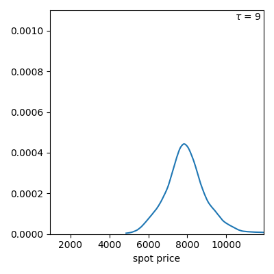
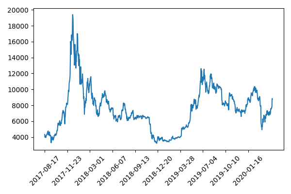

[](http://quantlet.de/)

## [](http://quantlet.de/) **CrypOpt_HistoricalDensity** [](http://quantlet.de/)

```yaml

Name of Quantlet: 'CrypOpt_HistoricalDensity'

Published in: 'DEDA_class_2020SS/DEDA_2020SS_Crypto_Options_RND_HD'

Description: 'Uses Monte Carlo sampling on historical returns to estimate historical density of underlying of an option.'

Keywords: 'sampling, crypto options, cryptocurrency, historical density, physical density, gif'

Author: 'Franziska Wehrmann'

See also: 'CrypOpt_RNDandHD'

Submitted:  '08. Aug 2020, Franziska Wehrmann'

Datafile: 'BTCUSDT.csv: Daily BTCUSDT price 2017-08-17 to 2020-04-30.'

```





### PYTHON Code
```python

import matplotlib
matplotlib.use('Agg')  # turn on when want to create GIF,
                         # otherwise will show all plots

import os
import math
import numpy as np
from matplotlib import pyplot as plt
import pandas as pd
import imageio

from historical_density import sampling, density_estimation


cwd = os.path.join(os.getcwd(), 'DEDA_2020SS_Crypto_Options_RND_HD',
                    'CrypOpt_HistoricalDensity')
data_path = os.path.join(cwd, 'data') + '/'

# ------------------------------------------------------------------- LOAD DATA
d_usd = pd.read_csv(data_path + 'BTCUSDT.csv')

# -------------------------------------------------------------------- SETTINGS
target = 'Adj.Close'
tau_day = 9
M = 10000
day = '2020-03-11'
S0 = d_usd.loc[d_usd.Date == day, target].iloc[0]
S = np.linspace(S0*0.3, S0*2, num=500)

# ------------------------------------------------------------ COMPUTE AND PLOT
# ----------------------------------------------------------------- TIME SERIES
fig1 = plt.figure(figsize=(6, 4))
ax = fig1.add_subplot(111)
plt.xticks(rotation=45)

ax.plot(d_usd.Date, d_usd[target])
locs, labels = plt.xticks()

locs_new = []
labels_new = []
for i in range(0, 10):
    j = i*math.floor(len(locs)/10)
    locs_new.append(j)
    labels_new.append(labels[i])

ax.set_xticks(locs_new)
plt.tight_layout()

fig1.savefig(os.path.join(cwd, 'BTC_17-20.png'), transparent=True)


# ----------------------------------------------------------- DIFFERENT KERNELS
tau_day = 9
h = 0.05

fig1 = plt.figure(figsize=(6, 4))
ax = fig1.add_subplot(111)

sample = sampling(d_usd, target, tau_day, S0, M=10000)

# Use 3 different kernel to estimate
S = np.linspace(sample.min()*0.99, sample.max()*1.01, num=500)
for kernel in ['gaussian', 'tophat', 'epanechnikov']:
    S = np.linspace(sample.min() * 0.99, sample.max() * 1.01, num=500)
    h_s0 = h * S0
    hd = density_estimation(sample, S, h_s0, kernel=kernel)
    ax.plot(S, hd, '-')

# Scatter plot of data samples and histogram
ax.scatter(sample, np.zeros(sample.shape[0]),
           zorder=15, color='red', marker='+', alpha=0.5, label='Samples')


# -------------------------------------------------------------------- GIF PLOT
def density_plot(tau_day, S0, M=10000, h=0.1, kernel='epanechnikov'):
    sample = sampling(d_usd, target, tau_day, S0, M)
    S = np.linspace(sample.min() * 0.99, sample.max() * 1.01, num=500)
    h_s0 = h * S0
    hd = density_estimation(sample, S, h_s0, kernel=kernel)

    fig2 = plt.figure(figsize=(4, 4))
    ax = fig2.add_subplot(111)
    ax.plot(S, hd, '-')
    ax.set_xlim(0.12*S0, 1.5*S0)
    ax.set_ylim(0, 0.0011)
    ax.text(0.99, 0.99, r'$\tau$ = ' + str(tau_day),
            horizontalalignment='right',
            verticalalignment='top',
            transform=ax.transAxes)
    ax.set_xlabel('spot price')
    plt.tight_layout()

    # Used to return the plot as an image rray
    fig2.canvas.draw()       # draw the canvas, cache the renderer
    image = np.frombuffer(fig2.canvas.tostring_rgb(), dtype='uint8')
    image = image.reshape(fig2.canvas.get_width_height()[::-1] + (3,))
    return image

# create gif
kwargs_write = {'fps': 5.0, 'quantizer': 'nq'}
imageio.mimsave(os.path.join(cwd, '{}_HD.gif'.format(day)),
                [density_plot(tau_day, S0) for tau_day in range(1,50+1)], fps=5)


# ----------------------------------------------------------------- SINGLE PLOT
def plot_HD(tau_day, S0, M=10000, h=0.1, kernel='epanechnikov'):
    sample = sampling(d_usd, target, tau_day, S0, M)
    S = np.linspace(sample.min()*0.99, sample.max()*1.01, num=500)
    h_s0 = h*S0
    hd = density_estimation(sample, S, h_s0, kernel=kernel)

    fig2 = plt.figure(figsize=(4, 4))
    ax = fig2.add_subplot(111)
    ax.plot(S, hd, '-')
    ax.set_xlim(0.12*S0, 1.5*S0)
    ax.set_ylim(0, 0.0011)
    ax.text(0.99, 0.99, r'$\tau$ = ' + str(tau_day),
         horizontalalignment='right',
         verticalalignment='top',
         transform=ax.transAxes)
    ax.set_xlabel('spot price')
    plt.tight_layout()
    return fig2

tau_day=9
fig = plot_HD(tau_day, S0)
fig.savefig(os.path.join(cwd, '{}_HD_T{}.png'.format(day,tau_day)), transparent=True)

```

automatically created on 2020-08-12