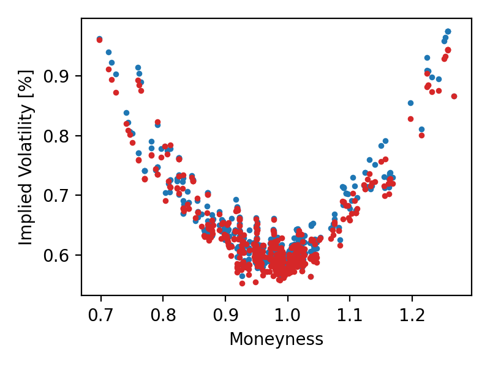

[](http://quantlet.de/)

## [](http://quantlet.de/) **CrypOpt_ImpliedVola** [](http://quantlet.de/)

```yaml

Name of Quantlet: 'CrypOpt_ImpliedVola'

Published in: 'DEDA_class_2020SS/DEDA_2020SS_Crypto_Options_RND_HD'

Description: 'Uses parameters of option to approximates the implied volatility via the Black-Scholes-Formula (red). Compares to implied volatility from Deribit API (blue).'

Keywords: 'implied volatility, bitcoin, options'

Author: 'Franziska Wehrmann'

Submitted:  '08. Aug 2020, Franziska Wehrmann'

Datafile: 'trades_clean.csv: Clean version of Deribit options trades, we are only interested in WHICH option were traded, not how often (delete duplicates).'

```



### PYTHON Code
```python

import os
import pandas as pd
import numpy as np
from scipy.stats import norm
from matplotlib import pyplot as plt

cwd =  os.path.join(os.getcwd(), 'DEDA_2020SS_Crypto_Options_RND_HD',
                    'CrypOpt_ImpliedVola')
data_path = os.path.join(cwd, 'data') + '/'


def BSValue(S, r, sigma, K, T, option):
    d1 = (np.log(S/K) + (r + 0.5*sigma**2)*T)/(sigma * np.sqrt(T))
    d2 = d1 - sigma * np.sqrt(T)

    if option == 'Call':
        return S * norm.cdf(d1) - K * np.exp(-r * T) * norm.cdf(d2)
    if option == 'Put':
        return K * np.exp(-r * T) * norm.cdf(-d2) - S * norm.cdf(-d1)


def implied_volatility(P, S, K, r, T, option, sigma, iterations,
                       convergance_threshold):
    diff_before = 1
    change = 0.1
    i = 0
    while (abs(diff_before) > convergance_threshold) and (i < iterations):

        BS_price = BSValue(S, r, sigma, K, T, option)
        # if negative, need to lower sigma (BS was too high)
        diff_after = P - BS_price
        if diff_after > 0:
            sigma *= (1 + change)
        elif diff_after < 0:
            sigma *= (1 - change)

        # if we crossed 0, we change sigma in smaller steps
        if np.sign(diff_before) * np.sign(diff_after) == -1:
            change *= 0.5

        i += 1
        diff_before = diff_after

    # did we stop because of convergance, or because max iterations
    if abs(diff_after) > convergance_threshold:
        print('reached max_iterations: ', i, K, sigma, diff_after)

    return (sigma)


def calculate_iv(df_tau, start_sigma=0.5, iterations=500,
                 convergance_threshold=10 ** (-9)):
    calls = df_tau[df_tau.option == 'C']
    puts = df_tau[df_tau.option == 'P']

    calls['BS_iv'] = calls.apply(lambda row:
             implied_volatility(P=row.P, S=row.S, K=row.K,
                                r=row.r, T=row.tau,
                                option='Call',
                                iterations=iterations,
                                convergance_threshold=convergance_threshold,
                                sigma=start_sigma)
             , axis=1)

    puts['BS_iv'] = puts.apply(lambda row:
           implied_volatility(P=row.P, S=row.S, K=row.K,
                              r=row.r, T=row.tau,
                              option='Put',
                              iterations=iterations,
                              convergance_threshold=convergance_threshold,
                              sigma=start_sigma)
           , axis=1)

    full = pd.concat([calls, puts], axis=1)
    return full


# ------------------------------------------------------------------------ MAIN
# ------------------------------------------------------------------- LOAD DATA
d = pd.read_csv(data_path + 'trades_clean.csv')

print(d.date.value_counts())
day = '2020-03-11'
df = d[(d.date == day)]
print(df.tau_day.value_counts())
tau_day = 9

df_tau = d[(d.tau_day == tau_day) & (d.date == day)]
print('Calculate IV for {} options, on {} with maturity T={}.'
      .format(df_tau.shape[0], day, tau_day))

# ---------------------------------------------------------------- CALCULATE IV
full = calculate_iv(df_tau)

# ------------------------------------------------------------------------ PLOT
fig = plt.figure(figsize=(4, 3))
ax = fig.add_subplot(111)
ax.scatter(full.M, full.iv, c='tab:blue', s=6)    # blue: Deribit IV
ax.scatter(full.M, full.BS_iv, c='tab:red', s=6)  # red: BS IV
ax.set_xlabel('Moneyness')
ax.set_ylabel('Implied Volatility [%]')
plt.tight_layout()

fig.savefig(os.path.join(cwd, 'ImpliedVola_{}_T{}.png'.format(day,tau_day)),
            transparent=True)
```

automatically created on 2020-08-12