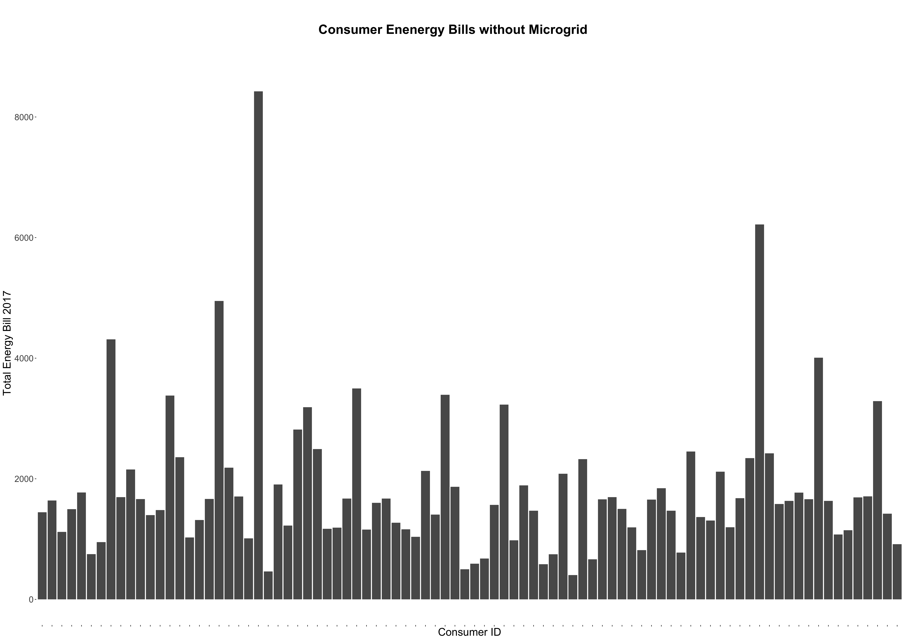
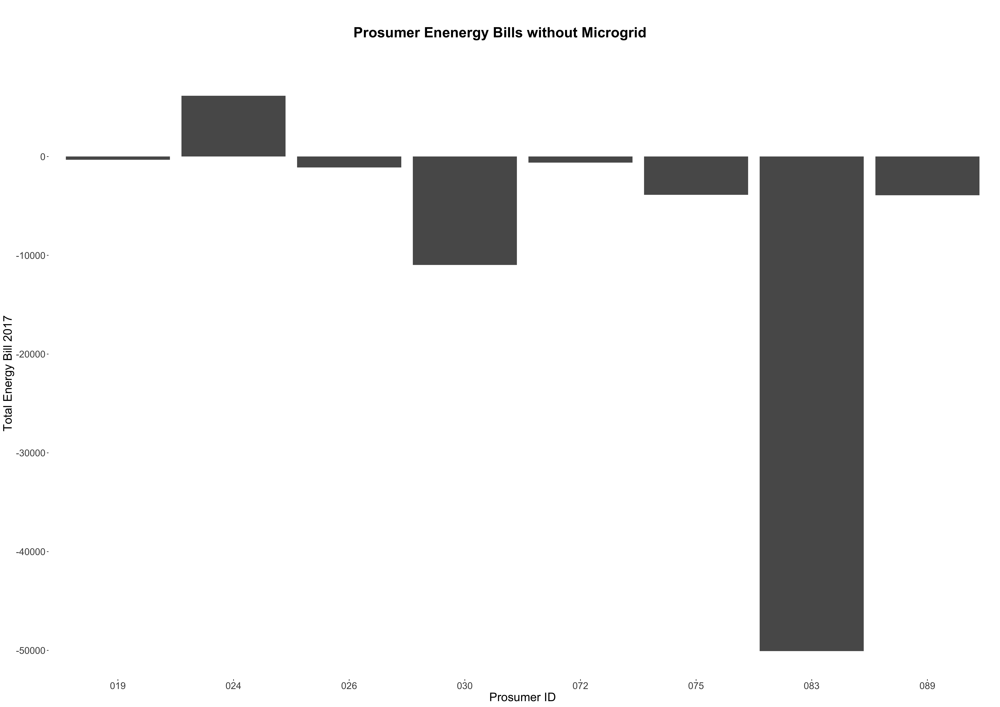
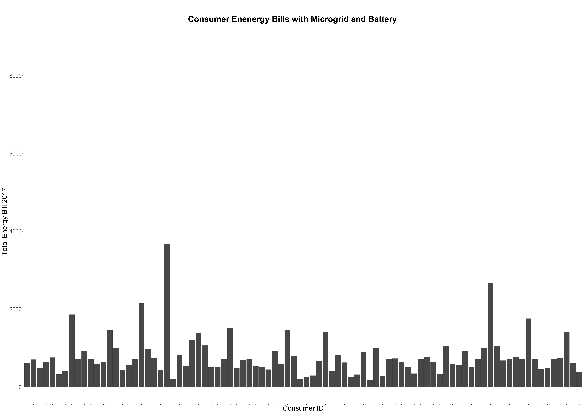
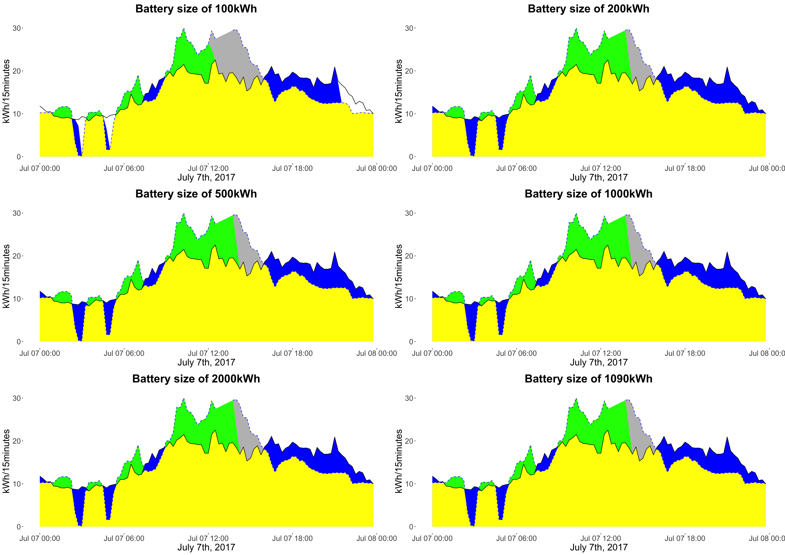
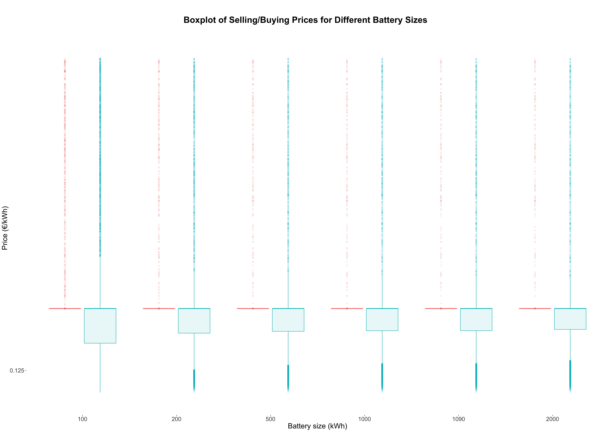
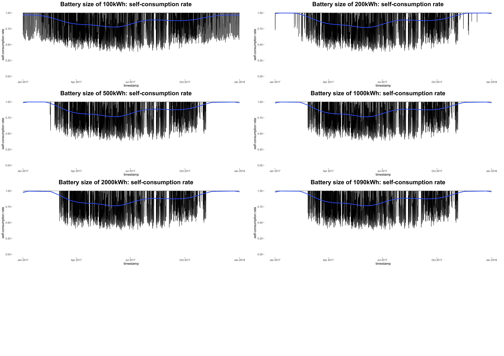
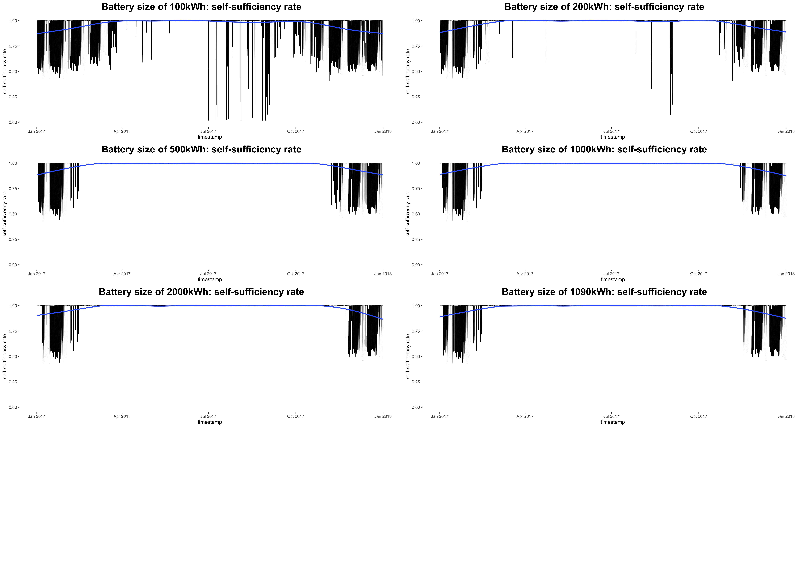

[](http://quantlet.de/)

## [](http://quantlet.de/) **Energy_Prosumer_3_Market_Simulation_with_Battery** [](http://quantlet.de/)

```yaml


Name of Quantlet: 'Energy_Prosumer_3_Market_Simulation_with_Battery'

Published in: 'DEDA_class_2020SS'

Description: 'Market simulation with a battery in a microgrid, battery charging and discharging rates in a microgrid with a battery and the supply demand ratio are calculated. Energy prices are then determined using the current tariffs in Germany and energy bills are calculated using a P2P pricing mechanism. The economic profitability of the microgrid is evaluated via self-consumption rates, self-sufficiency of the grid and a comparison of costs for the participants with and without P2P trading.'

Keywords: 'energy consumption, energy production, net load, battery simulation, line graph, boxplot, pricing mechanism, economic evaluation'

Author: 'Anna-Lena Hock and Sabrina Daun'

See also: 
- Energy_Prosumer_1_Descriptive_Statistics_of_energy_data
- Energy_Prosumer_2_Battery_Simulation
- Energy_Prosumer_4_Market_Simulation_without_Battery

Submitted:  '06.08.2020'

Datafile:
- 100 consumer datasets (named "consumer-00000xxx.csv")
- 100 prosumer datasets (named "producer-00000xxx.csv")

Input: 'csv-files containing energy production data in 15-minute time interval, self-consumption of prosumers, net production of prosumers, consumption of consumers,  aggregate production and consumption, net load and battery simulation'

Output: 'csv-files containing the interaction with the grid, the demand covered by the community grid, the battery charging power, the battery discharging power, 
the supply demand ratio, the energy selling and buying prices, the self-consumption rate of the grid, the self-sufficiency of the grid, the cost of the community energy, 
the energy bill of the consumer in a P2G model, the energy bill of the prosumer in a P2G model, the energy bill of the consumer in a P2P model, energy prices; 
the plotted self-consumption rate of the grid, the plotted self-sufficiency of the grid, the plotted energy bill of the consumer in a P2G model, the plotted energy bill of the prosumer in a P2G model,
the plotted energy bill of the consumer in a P2P model, a grid of plots for P2P energy sharing, boxplots of energy prices'

```
















### R Code
```r

#Market Simulation and Evaluation of Microgrid including Battery
#Description:  battery charging and discharging rates in a microgrid with a battery  and the supply demand ratio are calculated. Energy prices are then determined and the microgrid is evaluated via self-consumption rates, self-sufficiency of the grid and a comparison of costs for the participants with and without P2P trading


setwd("~/Documents/DEDA/Rise_of_the_prosumer/Energy_Prosumer_3_Market_Simulation_with_Battery") #adjust working directory accordingly to folder file is located in

#get data from https://github.com/QuantLet/BLEM/tree/master/data and add as subfolder to "Rise_of_the_prosumer" folder, i.e. same level as "Analysis" folder


rm(list=ls())

# Load packages
packages = c("cowplot",
             "purrr", "ggplot2", "lubridate")
invisible(lapply(packages, library, character.only = TRUE))

# Function for easy string pasting
"%&%"     = function(x, y) {paste(x, y, sep = "")}

#determine SDR (Supply-Demand-Ratio) at every time step

path = "../output/actual"

files <- list.files(path, pattern="*.csv", full.names=TRUE)
list2env(
  lapply(setNames(files, make.names(substr(gsub("*.csv$", "", files), 18, 53))), 
         read.csv), envir = .GlobalEnv)

size <- c(100, 200, 500, 1000, 2000, 1090)


#interaction with the grid

grid = matrix(NA, nrow = 35040, ncol = length(size))
# <0 means sold to grid, >0 means bought from grid
for (s in 1:length(size)){
  q = 3*s+1
  for (i in 1:nrow(grid)) {
    grid[i,s] = netload[i,2] + battery_simulation[i, q]
  }
}

write.csv(grid, "../output/actual/interaction_with_grid.csv")

feed_into_grid = matrix(NA, nrow = 35040, ncol = length(size))
for (s in 1:length(size)){
for (i in 1:nrow(grid)) {
  if (grid[i,s]<=0){feed_into_grid[i,s]=-grid[i,s]}
  else {feed_into_grid[i,s]=0}
}
}

grid_supply = matrix(NA, nrow = 35040, ncol = length(size))
for (s in 1:length(size)){
for (i in 1:nrow(grid)) {
  if (grid[i,s]>=0){grid_supply[i,s]=grid[i,s]}
  else {grid_supply[i,s]=0}
}
}

#demand covered by production of the microgrid

E_M = matrix(NA, nrow = 35040, ncol = length(size))
for (s in 1:length(size)){
  q = 3*s+1
  for (i in 1:nrow(E_M)) {
    if (netload[i, 2]>=0) {E_M[i,s] = aggregate_production_and_consumption[i,2]}
    else {E_M[i,s] = aggregate_production_and_consumption[i,3] + aggregate_production_and_consumption[i,4]}
  }
}

write.csv(E_M, "../output/actual/demand_covered_by_community_grid.csv")


#battery charging power

P_BC = matrix(NA, nrow = 35040, ncol = length(size))
for (s in 1:length(size)){
  q = 3*s+1
  for (i in 1:nrow(P_BC)) {
    if (battery_simulation[i,q]<=0) {P_BC[i,s] = 0}
    else {P_BC[i,s] = battery_simulation[i,q]}
  }
}

write.csv(P_BC, "../output/actual/charging_power.csv")


#battery discharging  power

P_DC = matrix(NA, nrow = 35040, ncol = length(size))
for (s in 1:length(size)){
  q = 3*s+1
  for (i in 1:nrow(P_DC)) {
    if (battery_simulation[i,q]>=0) {P_DC[i,s] = 0}
    else {P_DC[i,s] = -battery_simulation[i,q]}
  }
}

write.csv(P_DC, "../output/actual/discharging_power.csv")


# Supply-Demand-Ratio (SDR)


SDR = matrix(NA, nrow = 35040, ncol = length(size))

for (s in 1:length(size)){
  q = 3*s+1
  for (i in 1:nrow(netload)) {
    num = aggregate_production_and_consumption[i,2]-P_BC[i,s]+P_DC[i,s]
    denum = aggregate_production_and_consumption[i,3]+aggregate_production_and_consumption[i,4]
    SDR[i,s] = num/denum
    if (num == 0) {SDR[i,s]=0}
    else if (denum == 0) {SDR[i,s]=0}
    else {SDR[i,s]}
  }
}

write.csv(SDR, "../output/actual/SDR.csv")

# Determine Prices
# first column: Pr_sell at time t
# second column: Pr_buy at time t


price = matrix(NA, nrow = 35040, ncol = 2*length(size))
lambda_buy = 0.3137 #typical price for buying one kWh from the grid in Germany
lambda_sell = 0.1196 # feed in tariff for one kWh to the grid in Germany
lambda = 0.01 #compensation for prosumers

for (s in 1: length(size)){
  sell = 2*s-1
  buy = 2*s
  for (i in 1:nrow(price)) {
    if (SDR[i,s] >= 1) {
      price[i,sell] = lambda_sell + lambda / SDR[i,s]
      price[i,buy] = lambda_sell + lambda
    }
    else {
      price[i,sell] = ((lambda_sell + lambda)*lambda_buy)/((lambda_buy - lambda_sell - lambda) * SDR[i,s] + lambda_sell + lambda)
      price[i,buy] = price[i,sell] * SDR[i,s] + lambda_buy * (1-SDR[i,s])
    }
  }
}

write.csv(price, "../output/actual/Sell_Buy_Price.csv")


#Self-consumption of the grid
#The community’s self-consumption is defined as the ratio between the PV energy which is used by the community 
#(including the electric loads and energy used for charging batteries) and the overall PV generation

self_cons = matrix(NA, nrow = 35040, ncol = length(size))
for (s in 1:length(size)){
  q = 3*s+1
  for (i in 1:nrow(self_cons)) {
    num = E_M[i,s] + P_BC[i,s]
    denum = aggregate_production_and_consumption[i,2]
    self_cons [i,s] = num/ denum
  }
}

write.csv(self_cons, "../output/actual/self_consumption.csv")


plotgrids = list()
i = 1
for(i in 1: length(size)) {
  id = size[[i]]
  p_title = ggdraw() + 
    draw_label("Battery size of "%&% id %&%
                 "kWh: self-consumption rate",
               size     = 20,
               fontface = "bold")
  
  t = data.frame("time"   = seq.POSIXt(as.POSIXct("2017-01-01 00:00"),
                                       as.POSIXct("2018-01-01 00:00"),
                                       by = 900)[1:nrow(self_cons)],
                 "value" = self_cons[,i])
  
  p = ggplot(t, aes(x = time, y = value)) +
    geom_line() +
    geom_smooth()+
    scale_y_continuous(limits = c(0, 1)) +
    ylab("self-consumption rate") +
    xlab("timestamp") +
    theme(
      panel.background = element_rect(fill = "transparent"), # bg of the panel
      plot.background = element_rect(fill = "transparent", color = NA), # bg of the plot
      panel.grid.major = element_blank(), # get rid of major grid
      panel.grid.minor = element_blank(), # get rid of minor grid
      legend.background = element_rect(fill = "transparent"), # get rid of legend bg
      legend.box.background = element_rect(fill = "transparent") # get rid of legend panel bg
    )
  
  plotgrids[[i]] = plot_grid(p_title, p, ncol = 1, rel_heights = c(0.1, 1))
  
}

plot_grid(plotlist = plotgrids, nrow = 4, ncol = 2)
ggsave("smoothed_self-consumption_rate.png", height = 16.534, width = 23.384, bg="transparent")


#Self-sufficiency of the grid

#Self-sufficiency of a community describes the share of load that is supplied by the PV battery systems. 
#This includes the load supplied by the PV systems and the energy discharged from batteries.

self_suff = matrix(NA, nrow = 35040, ncol = length(size))
for (s in 1:length(size)){
  q = 3*s+1
  for (i in 1:nrow(self_suff)) {
    num = E_M[i,s] + P_DC[i,s]
    denum = aggregate_production_and_consumption[i,3] + aggregate_production_and_consumption[i,4]
    self_suff [i,s] = num/ denum
  }
}

write.csv(self_suff, "../output/actual/self_sufficiency.csv")


plotgrids = list()
i = 1
for(i in 1: length(size)) {
  id = size[[i]]
  p_title = ggdraw() + 
    draw_label("Battery size of "%&% id %&%
                 "kWh: self-sufficiency rate",
               size     = 20,
               fontface = "bold")
  
  t = data.frame("time"   = seq.POSIXt(as.POSIXct("2017-01-01 00:00"),
                                       as.POSIXct("2018-01-01 00:00"),
                                       by = 900)[1:nrow(self_suff)],
                 "value" = self_suff[,i])
  
  p = ggplot(t, aes(x = time, y = value)) +
    geom_line() +
    geom_smooth()+
    scale_y_continuous(limits = c(0, 1)) +
    ylab("self-sufficiency rate") +
    xlab("timestamp") +
    theme(
      panel.background = element_rect(fill = "transparent"), # bg of the panel
      plot.background = element_rect(fill = "transparent", color = NA), # bg of the plot
      panel.grid.major = element_blank(), # get rid of major grid
      panel.grid.minor = element_blank(), # get rid of minor grid
      legend.background = element_rect(fill = "transparent"), # get rid of legend bg
      legend.box.background = element_rect(fill = "transparent") # get rid of legend panel bg
    )
  
  plotgrids[[i]] = plot_grid(p_title, p, ncol = 1, rel_heights = c(0.1, 1))
  
}

plot_grid(plotlist = plotgrids, nrow = 4, ncol = 2)
ggsave("smoothed_self-sufficiency_rate.png", height = 16.534, width = 23.384, bg="transparent")


# Cost of community energy

C_P2P = matrix(NA, nrow = 35040, ncol = 2*length(size))
for (s in 1:length(size)){
  l = 2*s-1
  r = 2*s
  if (grid[i,s] <= 0) {C_P2P[,l] = lambda_buy*(- grid[i,s])}
  else {C_P2P[,l] = -lambda_sell* grid[i,s]}
  for (i in 1:nrow(C_P2P)) {
    if (i==1) {C_P2P[i,r]=C_P2P[i,l]}
    else {
      prev = C_P2P[i-1,r]
      nl = C_P2P[i,l]
      C_P2P[i,r]=prev+nl}
  }
}

tail(C_P2P)

write.csv(C_P2P, "../output/actual/community_cost_P2P.csv") 


#Energy bills of individual customers


#Energy Bill without P2P trading -> only interaction with grid (P2G)
path_c    = "../data/consumer/"
path_p    = "../data/prosumer/"
files_c = substring(list.files(path_c,
                               pattern = "*.csv"),
                    1, 17)[-c(13, 21, 26, 35, 46, 53, 57, 67, 76, 78, 80, 81)]
files_p = substring(list.files(path_p, pattern = "*.csv"),
                    1, 17)[c(19, 24, 26, 30, 72, 75, 83, 89)]

help = matrix(ncol=(ncol(cons)-1), nrow=nrow(price))
  for (i in 2:ncol(cons)){
    help[,(i-1)]=cons[,i]*lambda_buy
    i=i+1
  }
B_P2G_cons=as.data.frame(colSums(help))

write.csv(B_P2G_cons, "../output/actual/energy_bill_consumer_P2G.csv")

plotgrids = list()
i = 1
for(i in 1) {
  p_title = ggdraw() + 
    draw_label("Consumer Enenergy Bills without Microgrid",
               size     = 24,
               fontface = "bold")
  
  t = cbind(data.frame("id"   = substring(files_c, 15, 17)), B_P2G_cons)
  
  p = ggplot(t, aes(x=id, y = colSums(help))) +
    geom_bar(stat="identity") +
    scale_y_continuous(limits = c(0, 8500)) +
    ylab("Total Energy Bill 2017") +
    xlab("Consumer ID") +
    theme(
      axis.text.x = element_blank(),
      axis.text.y = element_text(size=16),
      axis.title.x = element_text(size=20),
      axis.title.y = element_text(size=20),
      panel.background = element_rect(fill = "transparent"), # bg of the panel
      plot.background = element_rect(fill = "transparent", color = NA), # bg of the plot
      panel.grid.major = element_blank(), # get rid of major grid
      panel.grid.minor = element_blank(), # get rid of minor grid
      legend.background = element_rect(fill = "transparent"), # get rid of legend bg
      legend.box.background = element_rect(fill = "transparent") # get rid of legend panel bg
    )
  
  plotgrids[[i]] = plot_grid(p_title, p, ncol = 1, rel_heights = c(0.1, 1))
  
}

plot_grid(plotlist = plotgrids, nrow = 1, ncol = 1)
ggsave("P2G_cons.png", height = 16.534, width = 23.384, bg="transparent")


help = matrix(ncol=(ncol(netprod)-1), nrow=nrow(price))

  for (i in 2:ncol(netprod)){
    for (t in 1:nrow(price)){
    if (netprod[t,i]>=0) {help[t, (i-1)]=-netprod[t,i]*lambda_sell}
    else {help[t, (i-1)]=-netprod[t,i]*lambda_buy}
      t=t+1}
    i=i+1
  }
B_P2G_prod=as.data.frame(colSums(help))

write.csv(B_P2G_prod, "../output/actual/energy_bill_prosumer_P2G.csv")

plotgrids = list()
i = 1
for(i in 1) {
  p_title = ggdraw() + 
    draw_label("Prosumer Enenergy Bills without Microgrid",
               size     = 24,
               fontface = "bold")
  
  t = cbind(data.frame("id"   = substring(files_p, 15, 17)), B_P2G_prod)
  
  p = ggplot(t, aes(x=id, y = colSums(help))) +
    geom_bar(stat="identity") +
    scale_y_continuous(limits = c(-50100, 6200)) +
    ylab("Total Energy Bill 2017") +
    xlab("Prosumer ID") +
    theme(
      axis.text.x = element_text(size=16),
      axis.text.y = element_text(size=16),
      axis.title.x = element_text(size=20),
      axis.title.y = element_text(size=20),
      panel.background = element_rect(fill = "transparent"), # bg of the panel
      plot.background = element_rect(fill = "transparent", color = NA), # bg of the plot
      panel.grid.major = element_blank(), # get rid of major grid
      panel.grid.minor = element_blank(), # get rid of minor grid
      legend.background = element_rect(fill = "transparent"), # get rid of legend bg
      legend.box.background = element_rect(fill = "transparent") # get rid of legend panel bg
    )
  
  plotgrids[[i]] = plot_grid(p_title, p, ncol = 1, rel_heights = c(0.1, 1))
  
}

plot_grid(plotlist = plotgrids, nrow = 1, ncol = 1)
ggsave("P2G_prod.png", height = 16.534, width = 23.384, bg="transparent")


#Energy Bill with P2P trading -> use Pricing Mechanism (P2P)


B_P2P_cons = as.data.frame(matrix(NA, ncol=length(size), nrow=(ncol(cons)-1)))
i=2
s=1
for (s in 1:length(size)){
  help = matrix(ncol=(ncol(cons)-1), nrow=nrow(price))
  for (i in 2:ncol(cons)){
    help[, (i-1)]=cons[,i]*price[,2*s]
    i=i+1
  }
  B_P2P_cons[,s]=as.data.frame(colSums(help))
  s=s+1
}
write.csv(B_P2P_cons, "../output/actual/energy_bill_consumer_P2P_battery.csv") 

plotgrids = list()
i = 1
for(i in 1) {
  p_title = ggdraw() + 
    draw_label("Consumer Enenergy Bills with Microgrid and Battery",
               size     = 24,
               fontface = "bold")
  
  t = cbind(data.frame("id"   = substring(files_c, 15, 17)), B_P2P_cons[,5])
  
  p = ggplot(t, aes(x=id, y = colSums(help))) +
    geom_bar(stat="identity") +
    scale_y_continuous(limits = c(0, 8500)) +
    ylab("Total Energy Bill 2017") +
    xlab("Consumer ID") +
    theme(
      axis.text.x = element_blank(),
      axis.text.y = element_text(size=16),
      axis.title.x = element_text(size=20),
      axis.title.y = element_text(size=20),
      panel.background = element_rect(fill = "transparent"), # bg of the panel
      plot.background = element_rect(fill = "transparent", color = NA), # bg of the plot
      panel.grid.major = element_blank(), # get rid of major grid
      panel.grid.minor = element_blank(), # get rid of minor grid
      legend.background = element_rect(fill = "transparent"), # get rid of legend bg
      legend.box.background = element_rect(fill = "transparent") # get rid of legend panel bg
    )
  
  plotgrids[[i]] = plot_grid(p_title, p, ncol = 1, rel_heights = c(0.1, 1))
}

plot_grid(plotlist = plotgrids, nrow = 1, ncol = 1)
ggsave("P2P_cons_bat.png", height = 16.534, width = 23.384, bg="transparent")


#P2P Energy Sharing Graph


consumption = matrix(NA, nrow = 35040, ncol = 1)
consumption[,1] = aggregate_production_and_consumption[,3] + aggregate_production_and_consumption[,4]
write.csv(consumption, "../output/actual/total_consumption.csv") 

plotgrids = list()
s=1
for (s in 1: length(size)) {
  id = size[[s]]
  p_title = ggdraw() + 
    draw_label("Battery size of "%&% id %&%
                 "kWh",
               size     = 24,
               fontface = "bold")
  #july 7th, 2017: day 189 of the year -> 18145:18240
  #december 21st, 2017: day 356 of the year -> 34177:34272
  t = data.frame("time"   = seq.POSIXt(as.POSIXct("2017-12-21 00:00"),
                                       as.POSIXct("2017-12-21 23:45"),
                                       by = 900)[1:96],
                 "value" = consumption[34177:34272,1])
  
  p = ggplot(t, aes(x = time)) +
    geom_area( aes(y = (E_M[34177:34272,s]+P_DC[34177:34272,s]+grid_supply[34177:34272,s])), fill="white") +
    geom_area( aes(y = (E_M[34177:34272,s]+P_BC[34177:34272,s]+feed_into_grid[34177:34272,s])), fill="grey") +
    geom_area( aes(y = (E_M[34177:34272,s]+P_BC[34177:34272,s])), fill="green") +
    geom_area( aes(y = (E_M[34177:34272,s]+P_DC[34177:34272,s])), fill="blue") +
    geom_area( aes(y = E_M[34177:34272,s]), color="yellow", fill="yellow") +
    geom_line( aes(y = aggregate_production_and_consumption[34177:34272,2]), color="blue", linetype="dashed")+
    geom_line( aes(y = value), color="black") +
    scale_y_continuous(limits = c(0, 30.5)) +
    ylab("kWh/15minutes") +
    xlab("December 21st, 2017") +
    theme(
      axis.title.x = element_text(size=20),
      axis.title.y = element_text(size=20),
      axis.text.x = element_text(size=16),
      axis.text.y = element_text(size=16),
      panel.background = element_rect(fill = "transparent"), # bg of the panel
      plot.background = element_rect(fill = "transparent", color = NA), # bg of the plot
      panel.grid.major = element_blank(), # get rid of major grid
      panel.grid.minor = element_blank(), # get rid of minor grid
      legend.background = element_rect(fill = "transparent"), # get rid of legend bg
      legend.box.background = element_rect(fill = "transparent") # get rid of legend panel bg
    )
      
      plotgrids[[s]] = plot_grid(p_title, p, ncol = 1, rel_heights = c(0.1, 1))
}

plot_grid(plotlist = plotgrids, nrow = 3, ncol = 2)
ggsave("P2P_energy_sharing_Dec21.png", height = 16.534, width = 23.384, bg="transparent")


#Boxplot of prices

df=data.frame(matrix(ncol=4, nrow=(12*nrow(price))))
y = c("time", "type", "id", "value")
colnames(df) <- y
df$type = factor(df$type, levels=c("sell", "buy"))
size_2 <- c(100, 100,  200, 200,  500, 500, 1000,1000, 2000, 2000, 1090, 1090)

df[,"time"] = 1:nrow(price)
df[,"type"] = sapply(sapply(c("sell","buy"),rep,35040),c)
df[,"id"] = sapply(sapply(size_2,rep,35040),c)
df[,"value"] = sapply(price,c)

df[,"type"] = as.factor(df[,"type"])
df[,"id"] = as.factor(df[,"id"])


p_title = ggdraw() + 
  draw_label("Boxplot of Selling/Buying Prices for Different Battery Sizes",
             size     = 24,
             fontface = "bold")

p = ggplot(df, aes(x = id, y=value, color=type)) +
  geom_boxplot(aes(fill=type), alpha=0.1)+
  scale_y_continuous(limits = c(0.123, 0.15), trans='log2') + #this graph will not include several values, however these are outliers, otherwise graph would have too big of a range
  ylab("Price (€/kWh)") +
  xlab("Battery size (kWh)")+
  theme(
    axis.title.x = element_text(size=20),
    axis.title.y = element_text(size=20),
    axis.text.x = element_text(size=16),
    axis.text.y = element_text(size=16),
    panel.background = element_rect(fill = "transparent"), # bg of the panel
    plot.background = element_rect(fill = "transparent", color = NA), # bg of the plot
    panel.grid.major = element_blank(), # get rid of major grid
    panel.grid.minor = element_blank(), # get rid of minor grid
    legend.background = element_rect(fill = "transparent"), # get rid of legend bg
    legend.box.background = element_rect(fill = "transparent"), # get rid of legend panel bg
    legend.position = "none"
  )
  
plotgrids = plot_grid(p_title, 
  p, ncol = 1, rel_heights = c(0.1, 1))

ggsave("price_log2.png", height = 16.534, width = 23.384, bg="transparent")

write.csv(df, "../output/actual/df_of_prices.csv") 


```

automatically created on 2020-08-17