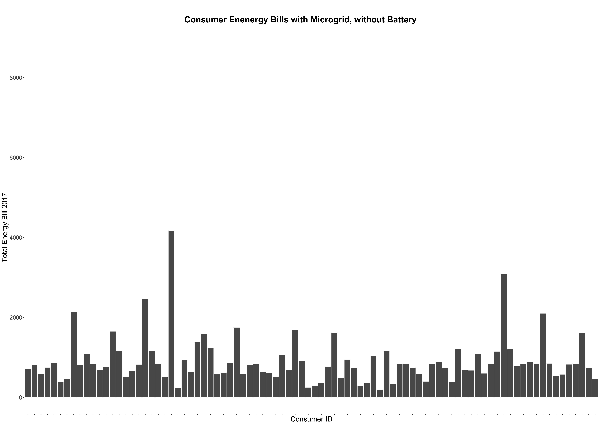
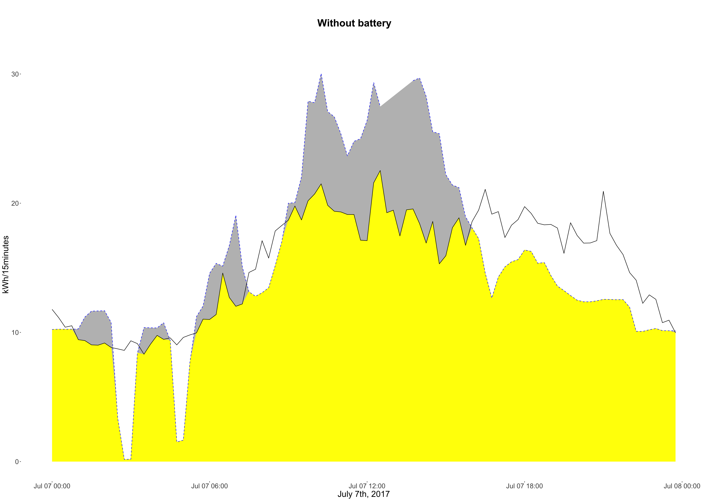
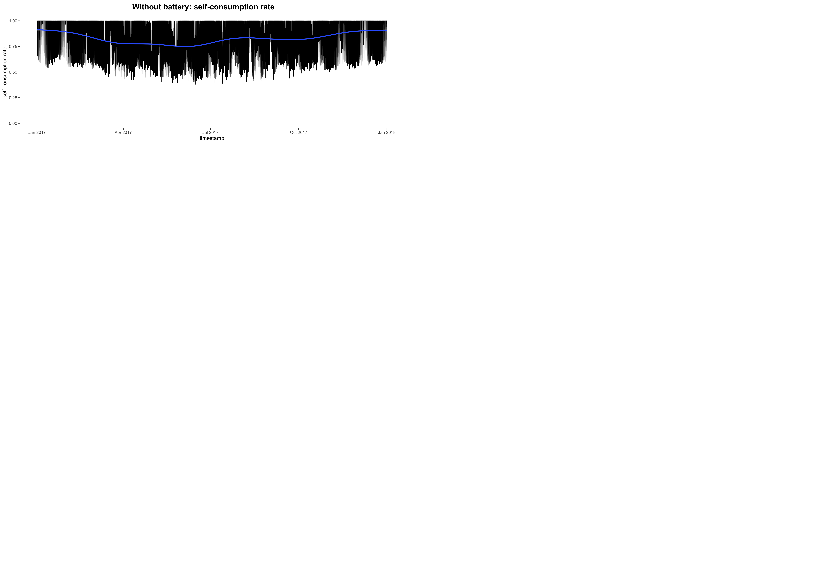
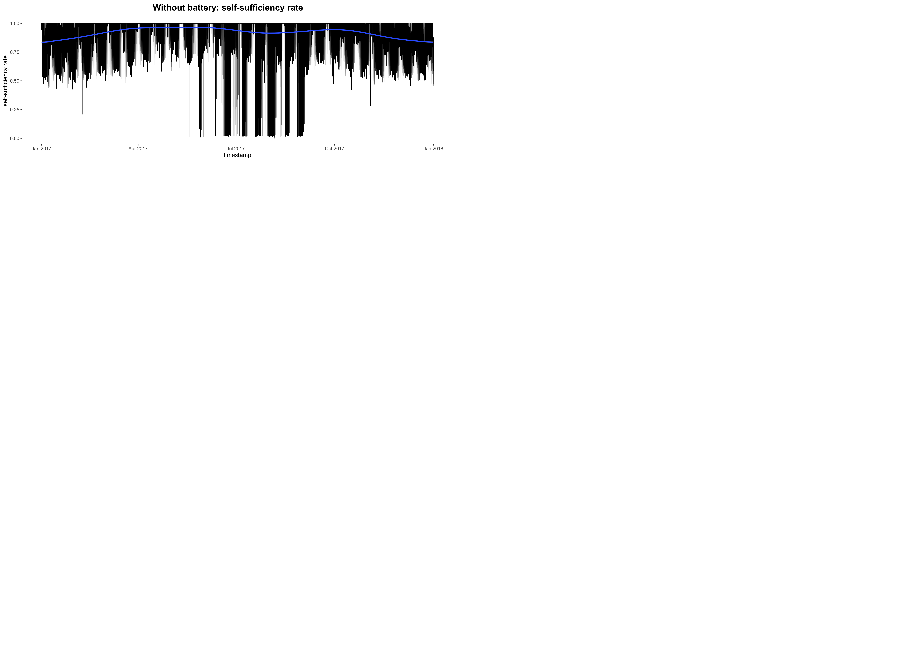

[](http://quantlet.de/)

## [](http://quantlet.de/) **Energy_Prosumer_4_Market_Simulation_without_Battery** [](http://quantlet.de/)

```yaml


Name of Quantlet: 'Energy_Prosumer_4_Market_Simulation_without_Battery'

Published in: 'DEDA_class_2020SS'

Description: 'Market simulation without battery in microgrid, the procedure is the same as in script 3 except for not including a battery in the microgrid. Again the supply demand ratio is calculated.  Energy prices are then determined using the current tariffs in Germany and energy bills are calculated using a P2P pricing mechanism. The economic profitability of the microgrid is evaluated via self-consumption rates,  self-sufficiency of the grid and the cost of community energy as well as individual energy bills.'  

Keywords: 'energy consumption, energy production, net load, line graph, pricing mechanism, economic evaluation'

Author: 'Anna-Lena Hock and Sabrina Daun'

See also: 
- Energy_Prosumer_1_Descriptive_Statistics_of_energy_data
- Energy_Prosumer_2_Battery_Simulation
- Energy_Prosumer_3_Market_Simulation_with_Battery

Submitted:  '06.08.2020'

Datafile:
- 100 consumer datasets (named "consumer-00000xxx.csv")
- 100 prosumer datasets (named "producer-00000xxx.csv")

Input: 'csv-files containing energy production data in 15-minute time interval, self-consumption of prosumers, net production of prosumers, consumption of consumers,  agregate production and consumption, net load and battery simulation'

Output: 'csv-files containing energy demand covered by production of the microgrid, the supply demand ratio with no battery, the energy selling and buying prices, the self-consumption rate of the grid, the self-sufficiency of the grid, the cost of the community energy, 
the energy bill of the consumer in a P2P model, energy prices; 
the plotted self-consumption rate of the grid, the plotted self-sufficiency of the grid, the plotted energy bill of the consumer in a P2P model, the plotted P2P energy sharing in summer'

```









### R Code
```r

#Market Simulation and Evaluation of Microgrid without Battery
#Description: market simulation microgrid without a battery: the supply demand ratio are calculated. Energy prices are then determined and the microgrid is evaluated via self-consumption rates, self-sufficiency of the grid and a comparison of costs for the participants with P2P trading, but no battery. 


setwd("~/Documents/DEDA/Rise_of_the_prosumer/Energy_Prosumer_4_Market_Simulation_without_Battery") #adjust working directory accordingly to folder file is located in

#get data from https://github.com/QuantLet/BLEM/tree/master/data and add as subfolder to "Rise_of_the_prosumer" folder, i.e. same level as "Analysis" folder


rm(list=ls())

# Load packages
packages = c("cowplot",
             "purrr", "ggplot2", "lubridate")
invisible(lapply(packages, library, character.only = TRUE))

# Function for easy string pasting
"%&%"     = function(x, y) {paste(x, y, sep = "")}


path = "../output/actual"

files <- list.files(path, pattern="*.csv", full.names=TRUE)
list2env(
  lapply(setNames(files, make.names(substr(gsub("*.csv$", "", files), 18, 53))), 
         read.csv), envir = .GlobalEnv)

size <- c(100, 200, 500, 1000, 2000, 1090
)


#interaction with the grid

grid = matrix(NA, nrow = 35040, ncol = 1)
# <0 means sold to grid, >0 means bought from grid

grid[,1] = netload[,2]
grid =as.data.frame(grid)

write.csv(grid, "../output/actual/nobattery_interaction_with_grid.csv")

feed_into_grid = matrix(NA, nrow = 35040, ncol = 1)
  for (i in 1:nrow(grid)) {
    if (grid[i,1]<=0){feed_into_grid[i,1]=-grid[i,1]}
    else {feed_into_grid[i,1]=0}
  }
feed_into_grid = as.data.frame(
  feed_into_grid
)

grid_supply = matrix(NA, nrow = 35040, ncol = 1)
  for (i in 1:nrow(grid)) {
    if (grid[i,1]>=0){grid_supply[i,1]=grid[i,1]}
    else {grid_supply[i,1]=0}
  }
grid_supply=as.data.frame(
  grid_supply
)


#demand covered by production of the microgrid

E_M = matrix(NA, nrow = 35040, ncol = 2)
  for (i in 1:nrow(E_M)) {
    if (netload[i, 2]>=0) {E_M[i,1] = aggregate_production_and_consumption[i,2]}
    else {E_M[i,1] = aggregate_production_and_consumption[i,3] + aggregate_production_and_consumption[i,4]}
  }

write.csv(E_M, "../output/actual/nobattery_demand_covered_by_community_grid.csv")


SDR = matrix(NA, nrow = 35040, ncol = 2)

  for (i in 1:nrow(netload)) {
    num = aggregate_production_and_consumption[i,2]
    denum = aggregate_production_and_consumption[i,3]+aggregate_production_and_consumption[i,4]
    SDR[i,1] = num/denum
    if (num == 0) {SDR[i,1]=0}
    else if (denum == 0) {SDR[i,1]=0}
    else {SDR[i,1]}
  }

write.csv(SDR, "../output/actual/nobattery_SDR.csv")

# Determine Prices
# first column: Pr_sell at time t
# second column: Pr_buy at time t


price = matrix(NA, nrow = 35040, ncol = 2)
lambda_buy = 0.3137 #typical price for buying one kWh from the grid in Germany
lambda_sell = 0.1196 # feed in tariff for one kWh to the grid in Germany
lambda = 0.01 #compensation for prosumers

  for (i in 1:nrow(price)) {
    if (SDR[i,1] >= 1) {
      price[i,1] = lambda_sell + lambda / SDR[i,1]
      price[i,2] = lambda_sell + lambda
    }
    else {
      price[i,1] = ((lambda_sell + lambda)*lambda_buy)/((lambda_buy - lambda_sell - lambda) * SDR[i,1] + lambda_sell + lambda)
      price[i,2] = price[i,1] * SDR[i,1] + lambda_buy * (1-SDR[i,1])
    }
  }


write.csv(price, "../output/actual/nobattery_Sell_Buy_Price.csv")


#Self-consumption of the grid
#The community’s self-consumption is defined as the ratio between the PV energy which is used by the community 
#(including the electric loads and energy used for charging batteries) and the overall PV generation

self_cons = matrix(NA, nrow = 35040, ncol = 1)
  for (i in 1:nrow(self_cons)) {
    num = E_M[i,1]
    denum = aggregate_production_and_consumption[i,2]
    self_cons [i,1] = num/ denum
  }
self_cons=as.data.frame(self_cons)
write.csv(self_cons, "../output/actual/nobattery_self_consumption.csv")


plotgrids = list()
i = 1
for(i in 1) {
  id = size[[i]]
  p_title = ggdraw() + 
    draw_label("Without battery: self-consumption rate",
               size     = 16,
               fontface = "bold")
  
  t = data.frame("time"   = seq.POSIXt(as.POSIXct("2017-01-01 00:00"),
                                       as.POSIXct("2018-01-01 00:00"),
                                       by = 900)[1:nrow(self_cons)],
                 "value" = self_cons[,1])
  
  p = ggplot(t, aes(x = time, y = value)) +
    geom_line() +
    geom_smooth()+
    scale_y_continuous(limits = c(0, 1)) +
    ylab("self-consumption rate") +
    xlab("timestamp") +
    theme(
      panel.background = element_rect(fill = "transparent"), # bg of the panel
      plot.background = element_rect(fill = "transparent", color = NA), # bg of the plot
      panel.grid.major = element_blank(), # get rid of major grid
      panel.grid.minor = element_blank(), # get rid of minor grid
      legend.background = element_rect(fill = "transparent"), # get rid of legend bg
      legend.box.background = element_rect(fill = "transparent") # get rid of legend panel bg
    )
  
  plotgrids[[i]] = plot_grid(p_title, p, ncol = 1, rel_heights = c(0.1, 1))
  
}

plot_grid(plotlist = plotgrids, nrow = 4, ncol = 2)
ggsave("nobattery_smoothed_self-consumption_rate_2.png", height = 16.534, width = 23.384, bg="transparent")


#Self-sufficiency of the grid

#Self-sufficiency of a community describes the share of load that is supplied by the PV battery systems. 
#This includes the load supplied by the PV systems and the energy discharged from batteries.

self_suff = matrix(NA, nrow = 35040, ncol = 1)

  for (i in 1:nrow(self_suff)) {
    num = E_M[i,1]
    denum = aggregate_production_and_consumption[i,3] + aggregate_production_and_consumption[i,4]
    self_suff [i,1] = num/ denum
  }
self_suff=as.data.frame(self_suff)
write.csv(self_suff, "../output/actual/nobattery_self_sufficiency.csv")


plotgrids = list()
i = 1
for(i in 1) {
  id = size[[i]]
  p_title = ggdraw() + 
    draw_label("Without battery: self-sufficiency rate",
               size     = 16,
               fontface = "bold")
  
  t = data.frame("time"   = seq.POSIXt(as.POSIXct("2017-01-01 00:00"),
                                       as.POSIXct("2018-01-01 00:00"),
                                       by = 900)[1:nrow(self_suff)],
                 "value" = self_suff[,i])
  
  p = ggplot(t, aes(x = time, y = value)) +
    geom_line() +
    geom_smooth()+
    scale_y_continuous(limits = c(0, 1)) +
    ylab("self-sufficiency rate") +
    xlab("timestamp") +
    theme(
      panel.background = element_rect(fill = "transparent"), # bg of the panel
      plot.background = element_rect(fill = "transparent", color = NA), # bg of the plot
      panel.grid.major = element_blank(), # get rid of major grid
      panel.grid.minor = element_blank(), # get rid of minor grid
      legend.background = element_rect(fill = "transparent"), # get rid of legend bg
      legend.box.background = element_rect(fill = "transparent") # get rid of legend panel bg
    )
  
  plotgrids[[i]] = plot_grid(p_title, p, ncol = 1, rel_heights = c(0.1, 1))
  
}

plot_grid(plotlist = plotgrids, nrow = 4, ncol = 2)
ggsave("nobattery_smoothed_self-sufficiency_rate_2.png", height = 16.534, width = 23.384, bg="transparent")


# Cost of community energy

C_P2P = matrix(NA, nrow = 35040, ncol = 2)
  l = 1
  r = 2
  if (grid[i,1] <= 0){C_P2P[,l] = lambda_buy*(- grid[i,1])} else{C_P2P[,l] = -lambda_sell* grid[i,1]}
  
  for (i in 1:nrow(C_P2P)) {
    if (i==1) {C_P2P[i,r]=C_P2P[i,l]}
    else {
      prev = C_P2P[i-1,r]
      nl = C_P2P[i,l]
      C_P2P[i,r]=prev+nl}
  }


write.csv(C_P2P, "../output/actual/nobattery_community_cost_P2P.csv") 
tail(C_P2P)

#Energy bills of individual customers
path_c    = "../data/consumer/"
files_c = substring(list.files(path_c,
                               pattern = "*.csv"),
                    1, 17)[-c(13, 21, 26, 35, 46, 53, 57, 67, 76, 78, 80, 81)]

B_P2P_cons_nobat = as.data.frame(matrix(NA, ncol=1, nrow=(ncol(cons)-1)))
i=2
help = matrix(ncol=(ncol(cons)-1), nrow=nrow(price))
for (i in 2:ncol(cons)){
    help[, (i-1)]=cons[,i]*price[,2]
    i=i+1
  }
B_P2P_cons_nobat[,1]=as.data.frame(colSums(help))

write.csv(B_P2P_cons_nobat, "../output/actual/energy_bill_consumer_P2P_nobattery.csv") 

plotgrids = list()
i = 1
for(i in 1) {
  p_title = ggdraw() + 
    draw_label("Consumer Enenergy Bills with Microgrid, without Battery",
               size     = 24,
               fontface = "bold")
  
  t = cbind(data.frame("id"   = substring(files_c, 15, 17)), B_P2P_cons_nobat[,1])
  
  p = ggplot(t, aes(x=id, y = colSums(help))) +
    geom_bar(stat="identity") +
    scale_y_continuous(limits = c(0, 8500)) +
    ylab("Total Energy Bill 2017") +
    xlab("Consumer ID") +
    theme(
      axis.text.x = element_blank(),
      axis.text.y = element_text(size=16),
      axis.title.x = element_text(size=20),
      axis.title.y = element_text(size=20),
      panel.background = element_rect(fill = "transparent"), # bg of the panel
      plot.background = element_rect(fill = "transparent", color = NA), # bg of the plot
      panel.grid.major = element_blank(), # get rid of major grid
      panel.grid.minor = element_blank(), # get rid of minor grid
      legend.background = element_rect(fill = "transparent"), # get rid of legend bg
      legend.box.background = element_rect(fill = "transparent") # get rid of legend panel bg
    )
  
  plotgrids[[i]] = plot_grid(p_title, p, ncol = 1, rel_heights = c(0.1, 1))
}

plot_grid(plotlist = plotgrids, nrow = 1, ncol = 1)
ggsave("P2P_cons_nobat.png", height = 16.534, width = 23.384, bg="transparent")


#P2P Energy Sharing Graph


consumption = matrix(NA, nrow = 35040, ncol = 1)
consumption[,1] = aggregate_production_and_consumption[,3] + aggregate_production_and_consumption[,4]
consumption=as.data.frame(consumption)

plotgrids = list()
s=1
for (s in 1) {
  p_title = ggdraw() + 
    draw_label("Without battery",
               size     = 24,
               fontface = "bold")
  
  q = 3*i-1
  #july 7th, 2017: day 189 of the year -> 18145:18240
  t = data.frame("time"   = seq.POSIXt(as.POSIXct("2017-07-07 00:00"),
                                       as.POSIXct("2017-07-07 23:45"),
                                       by = 900)[1:96],
                 "value" = consumption[18145:18240,1])
  
  p = ggplot(t, aes(x = time)) +
    geom_area( aes(y = (E_M[18145:18240,s]+grid_supply[18145:18240,s])), fill="white") +
    geom_area( aes(y = (E_M[18145:18240,s]+feed_into_grid[18145:18240,s])), fill="grey") +
    geom_area( aes(y = E_M[18145:18240,s]), color="yellow", fill="yellow") +
    geom_line( aes(y = aggregate_production_and_consumption[18145:18240,2]), color="blue", linetype="dashed")+
    geom_line( aes(y = value), color="black") +
    scale_y_continuous(limits = c(0, 30.5)) +
    ylab("kWh/15minutes") +
    xlab("July 7th, 2017") +
    theme(
      axis.title.x = element_text(size=20),
      axis.title.y = element_text(size=20),
      axis.text.x = element_text(size=16),
      axis.text.y = element_text(size=16),
      panel.background = element_rect(fill = "transparent"), # bg of the panel
      plot.background = element_rect(fill = "transparent", color = NA), # bg of the plot
      panel.grid.major = element_blank(), # get rid of major grid
      panel.grid.minor = element_blank(), # get rid of minor grid
      legend.background = element_rect(fill = "transparent"), # get rid of legend bg
      legend.box.background = element_rect(fill = "transparent") # get rid of legend panel bg
    )
  
  plotgrids[[s]] = plot_grid(p_title, p, ncol = 1, rel_heights = c(0.1, 1))
  
}

plot_grid(plotlist = plotgrids)
ggsave("P2P_energy_sharing_nobat_July7.png", height = 16.534, width = 23.384, bg="transparent")


```

automatically created on 2020-08-17